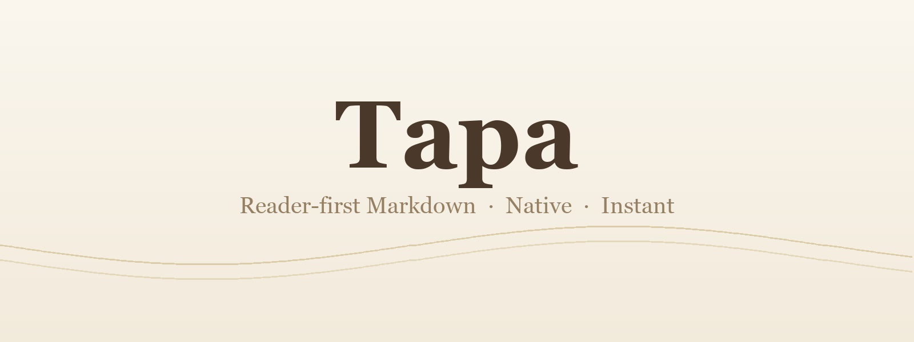

<div align="center">



# Tapa

[](https://github.com/aryrabelo/tapa/releases/latest)
[](LICENSE)


**A fast, minimal, Rust-based Markdown reader and editor — reader-first, native desktop, ~5 MB download, boots instantly.**

⭐ Star Tapa on GitHub — it's a one-person project and every star helps.

</div>

## Table of contents

- [💡 The idea](#-the-idea)
- [✨ Features](#-features)
- [⌨️ Keyboard shortcuts](#️-keyboard-shortcuts)
- [📦 Install](#-install)
- [🤖 Agent access (MCP)](#-agent-access-mcp)
- [🐞 Bug capture (dev)](#-bug-capture-dev)
- [🛠️ How it's built](#️-how-its-built)
- [🗂️ Project layout](#️-project-layout)
- [✅ Verification](#-verification)
- [📛 Naming](#-naming)
- [🚫 Non-goals (v1)](#-non-goals-v1)
- [🤝 Contributing](#-contributing)
- [📄 License](#-license)

## 💡 The idea

Tapa is **reader-first**. You point it at a folder of Markdown and you _read_ —
clean, rendered prose, nothing in the way. Editing is on demand, not the default
mode: double-click the exact block you want to change and you drop straight into
an editor with the cursor where you clicked. Double-click again and you are back
to reading.

The goal is the fastest, simplest, most beautiful native Markdown reader on the
desktop — native window, OS-native light/dark, instant startup, no Electron
bloat. The heavy machinery (editor engine, Markdown renderer, command palette)
is loaded only when you actually use it, so the app opens cold with a fraction
of the usual web-app weight.

## ✨ Features

- **Reader-first rendering** — open a folder (a "vault") and read rendered
  Markdown. CommonMark + GFM: headings, lists, bold/italic, links, images,
  blockquotes, tables, task lists, strikethrough, code blocks.
- **Inline edit on demand** — double-click a rendered block to edit it at the
  clicked position (CodeMirror); double-click again to return to the reader.
- **Collapsible file tree** — sidebar with the folder tree; toggle with `⌘B`.
- **Fuzzy file finder** — `⌘K` to jump between files by name.
- **Content search** — `⌘⇧F` to search inside files; matches stream in from Rust
  grouped by file with the match highlighted, and `Enter` jumps to the line.
- **Find in file** — `⌘F` to find within the open document; matches are
  highlighted in place, `Enter` / `⇧Enter` step through them, `Esc` closes.
- **Live reload** — external changes on disk reload automatically; if you have
  unsaved edits, Tapa asks before discarding them.
- **OS-native theme** — follows your system light/dark appearance, with a manual
  light / dark / system toggle.
- **Open a folder or a single file** — single files are scoped to their parent
  so save and watch keep working.
- **macOS file association** — register Tapa as a reader for `.md` / `.markdown`.

> [!TIP]
> Reach for `⌘⇧F` when you don't remember _which_ file said it. Content search
> streams matches from Rust grouped by file; press `Enter` on a match to jump
> straight to that line.

## ⌨️ Keyboard shortcuts

| Shortcut | Action |
| --- | --- |
| `⌘K` / `Ctrl-K` | Open the fuzzy file finder |
| `⌘F` / `Ctrl-F` | Find in the current file |
| `⌘⇧F` / `Ctrl-Shift-F` | Search inside files (content) |
| `⌘B` / `Ctrl-B` | Toggle the sidebar |
| `⌘S` / `Ctrl-S` | Save and return to the reader |
| Double-click | Enter edit mode at that position / exit edit mode |

## 📦 Install

Tapa runs on macOS, Linux, and Windows. Download a small native installer
or build from source — both work the same on all three platforms.

### Download a prebuilt installer

Grab the file for your platform from the
[**latest release**](https://github.com/aryrabelo/tapa/releases/latest):

| Platform | Download | Size | Install |
| --- | --- | --- | --- |
| macOS | `.dmg` (Apple Silicon `aarch64` / Intel `x64`) | ~5 MB | Open it, drag **Tapa** to Applications. |
| Linux | `.AppImage` | ~74 MB | `chmod +x Tapa_*.AppImage && ./Tapa_*.AppImage` |
| Linux (Debian/Ubuntu) | `.deb` | ~2.4 MB | `sudo apt install ./Tapa_*.deb` |
| Linux (Fedora/RHEL) | `.rpm` | ~2.4 MB | `sudo rpm -i Tapa_*.rpm` |
| Windows | `.exe` / `.msi` | ~2 MB | Run the installer. |

_The Linux `.AppImage` bundles its own runtime (~74 MB); the `.deb` / `.rpm` use system libraries (~2.4 MB)._

> [!NOTE]
> The app is currently unsigned, so the OS warns on first launch: on macOS use
> right-click → **Open** to get past Gatekeeper; on Windows click
> **More info → Run anyway** in SmartScreen. Code signing is planned.

### Build from source

#### Prerequisites

- [Node](https://nodejs.org) 18+
- [Rust](https://rustup.rs) (stable toolchain)
- Tauri v2 system prerequisites — see
  <https://v2.tauri.app/start/prerequisites/>

#### Build the app

```sh
npm install
npm run tauri build
```

The packaged app is written to
`src-tauri/target/release/bundle/` (`.app` / `.dmg` on macOS, `.deb` /
`.AppImage` / `.rpm` on Linux, `.msi` / `.exe` on Windows).

#### Run in development

```sh
npm run tauri dev
```

## 🤖 Agent access (MCP)

Tapa ships an **optional** Model Context Protocol server, `tapa-mcp`, so an AI
agent (Claude Code, Codex, Cursor, …) can read and search your vault. It is a
**separate binary, not bundled** with the app — whoever doesn't need it never
builds it, and the ~5 MB reader stays a pure reader.

It speaks newline-delimited JSON-RPC over stdio, reuses the same Rust I/O as the
app (zero extra dependencies), and reads are guarded against escaping the vault.
Tools: `list`, `read`, `search` (read-only by default) plus `append` and
`patch` when started with `--write`. `patch` edits a block by `^block-id` or a
section by heading with an `if_match` precondition (refuses on drift); writes
are atomic (temp + rename).

It also exposes the vault as MCP **resources** with live **subscriptions**:
`resources/subscribe` to a file and the agent is *pushed* `resources/updated`
the instant it changes on disk (and `resources/list_changed` on add/remove) —
reactive, not polling. Available without `--write`.

```sh
cd src-tauri && cargo build --release --bin tapa-mcp
# binary at src-tauri/target/release/tapa-mcp

# Claude Code (any MCP client works — run `tapa-mcp <vault>` as a stdio server):
claude mcp add tapa -- /absolute/path/to/tapa-mcp /absolute/path/to/your/vault

# read + write (append/patch) — omit --write for read-only:
claude mcp add tapa -- /absolute/path/to/tapa-mcp /absolute/path/to/your/vault --write
```

## 🐞 Bug capture (dev)

Tapa can mount an optional, in-app **bug-capture overlay**
([bugtoprompt](https://github.com/aryrabelo/bugtoprompt)) that turns a bug into
an AI-ready prompt: it records your clicks, interactive DOM snapshots, and an
optional live voice narration, then lets you **copy** or **download** the
rendered prompt to paste into your AI tool of choice.

It is a developer tool, off by default, and fully removed from normal builds.
To enable it, copy `.env.example` to `.env` and set the flags:

```sh
cp .env.example .env
# .env
VITE_BUGTOPROMPT=1
VITE_ASSEMBLYAI_API_KEY=your-assemblyai-key   # optional, for voice transcription
```

Then run `npm run tauri dev`. A floating bug button appears in the bottom-right.
Voice transcription uses [AssemblyAI](https://www.assemblyai.com/); the key
stays local (read from your `.env`) and the streaming token is minted natively
in Rust so it works inside the desktop webview. Without a key, click + DOM
capture and copy/download still work — only the voice caption is disabled.

## 🛠️ How it's built

Tapa is a thin native shell around a web frontend:

- **Frontend** — React 19 + Vite, Tailwind v4 + shadcn tokens. Markdown is
  rendered in JS with `react-markdown` (remark/GFM); editing uses CodeMirror 6.
- **Backend** — Rust (Tauri v2) handles only I/O: folder scan, file read/write,
  and a filesystem watcher for live reload. No business logic lives in Rust.
- **Startup budget** — the boot bundle is aggressively code-split. The editor
  (CodeMirror), the Markdown renderer, the command palette, the sidebar, and
  toasts each load on demand instead of at startup. The result: the eager bundle
  the webview parses at launch is about **~27 KB gzip JS + ~9 KB gzip CSS** — a
  fraction of a typical web-app boot bundle — while the heavy chunks stream in
  only when a feature is first used.

## 🗂️ Project layout

```
src/             React frontend
  components/     UI: reader, editor, sidebar, command palette
  lib/            Tauri bindings, tree/fuzzy/source-map/theme helpers
  state/          zustand store
  index.css       Tailwind v4 + shadcn tokens
src-tauri/       Rust backend (file I/O, folder scan, file watcher)
```

## ✅ Verification

```sh
npm run test            # Vitest unit tests
npm run lint            # Biome
npm run build           # tsc + Vite production build
cd src-tauri && cargo test
```

## 🔄 Auto-update & releasing

Tapa updates itself from **GitHub Releases**. The updater plugin checks
`latest.json` on the latest published release; **Check for Updates** (command
palette / right-click) downloads, verifies, installs, and relaunches. Updates
are signed — an unsigned or tampered build is refused.

One-time signing setup (required before the first release that should auto-update):

```sh
# 1. Generate a minisign keypair (keep the private key OUT of the repo):
CI=true npx tauri signer generate -w ~/.tauri/tapa.key

# 2. Put the PUBLIC key into src-tauri/tauri.conf.json →
#    plugins.updater.pubkey   (replaces REPLACE_WITH_MINISIGN_PUBLIC_KEY)

# 3. Add the PRIVATE key + its password as GitHub repo secrets:
#    TAURI_SIGNING_PRIVATE_KEY            (the key file contents)
#    TAURI_SIGNING_PRIVATE_KEY_PASSWORD   (the password you chose)
```

`release.yml` then signs the bundles and uploads `latest.json` on a version tag.
Until the public key is set, Check for Updates fails closed (verification can't
pass) — safe, but non-functional, by design.

### Download size budget

`size-budget.json` caps the macOS `.dmg` and `.app` size. CI (and the weekly
build) run `node scripts/check-size.mjs` after building and **fail** if an
artifact exceeds its budget. The budget is never auto-raised: a human reviews
the growth and bumps the number by hand. Keeps the install footprint honest.

## 📛 Naming

**Tapa** is chosen for its double meaning:

- **Tapajós** — the river and region in the west of Pará, Brazil, where the
  author is from. _TAPA_, from Tapajós. The region carries its own identity:
  there is a long-running movement to carve a separate **State of Tapajós** out
  of western Pará. In Brazil's largest-ever regional plebiscite (11 December
  2011), the Tapajós region itself voted overwhelmingly to secede — the "yes"
  reached up to ~99% in some municipalities and ~80% across the region — but the
  measure was defeated statewide (~66% against), outvoted by the populous east
  around Belém. The cause is still alive in Congress: a bill (PDL 508/2019) that
  would trigger a fresh plebiscite remains before the Senate.
- **Tapa** (the slap) — in Portuguese, a _tapa_ is a slap. Like a slap, the app
  is unexpectedly fast — a quick, sharp strike.

The product name, the bundle identifier (`com.aryrabelo.tapa`), and the window
title are all `Tapa`. The Rust crate is still named `app` internally.

## 🚫 Non-goals (v1)

- No syntax highlighting in code blocks
- No math (KaTeX)
- No diagrams (Mermaid)
- No inline per-block live preview (Typora / Obsidian style)
- No custom native window chrome (vibrancy, integrated traffic lights)
- No multi-window
- No cloud / sync

## 🤝 Contributing

Bug reports, feature ideas, and pull requests are welcome. See
[CONTRIBUTING.md](CONTRIBUTING.md) for how to set up the project, the
verification steps a change must pass, and the scope this project keeps (see
**Non-goals** above). Security issues: please follow
[SECURITY.md](SECURITY.md) instead of opening a public issue.

## 📄 License

[MIT](LICENSE) © Ary Rabelo
